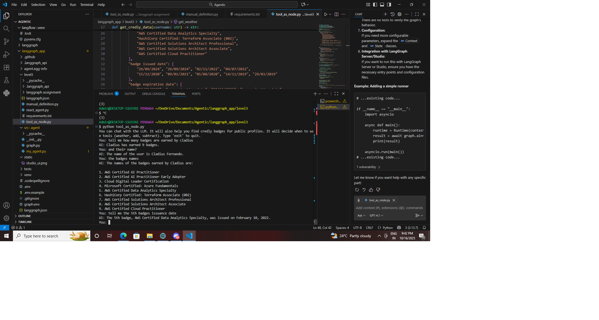
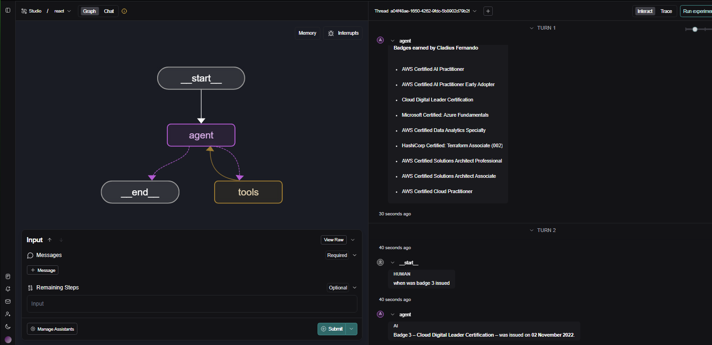

# Credly Badge Viewer using Langgraph and LangChain

This project demonstrates a conversational AI system that interacts with **Credly public badge profiles** using **Langgraph** and **LangChain** frameworks. Users can query badge information, issuance dates, expiration, and credit points.

---

## **Features / Use Case Scenarios**

1. **Fetch Credly Badges**
   - Input a username (e.g., Cladius, Tushar) to fetch public badge information.
   - Output includes:
     - Badge Name
     - Issued Date
     - Expiration Date
     - Credit Points

**Example:**
```text
You: Show badges for Cladius
AI: User: Cladius Fernando
    Badges Earned:
    - AWS Certified AI Practitioner
      Issued: 26/09/2024
      Expires: 26/09/2027
      Credit Points: 2
    - Microsoft Certified: Azure Fundamentals
      Issued: 04/07/2022
      Expires: no expiration date
      Credit Points: 3
    ...





