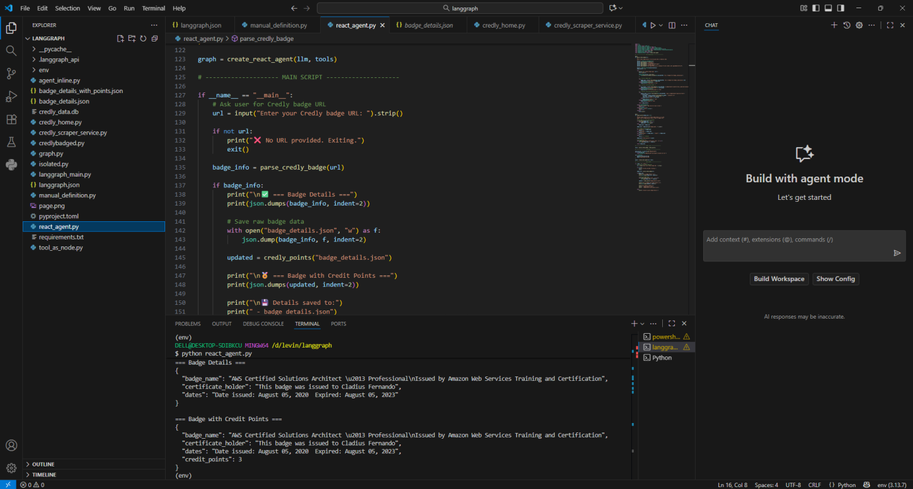
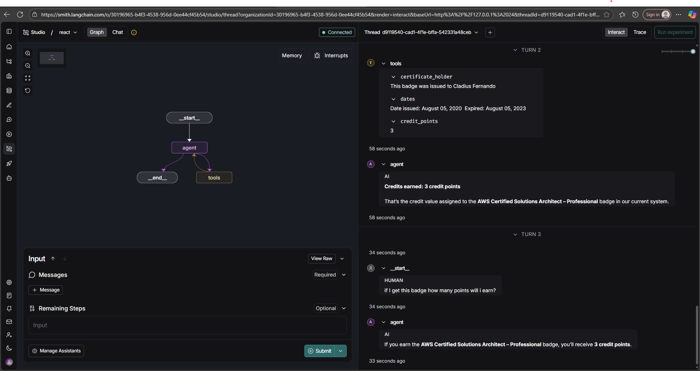
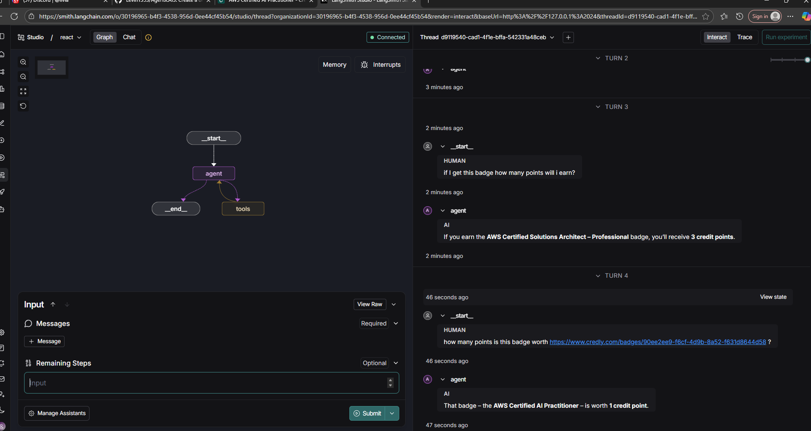

# Credly Badge Parser & Scoring Agent

This Python project automates the extraction and scoring of **Credly badges** using **Selenium** and **LangChain** with a **Groq-powered LLM agent**.

It performs two main functions:
1. Scrape badge details (name, holder, issue/expiry dates) from a Credly badge URL.  
2. Assign credit points automatically based on the badge level (Foundation, Associate, Professional, Expert).

---

## Features

- Headless browser automation using Selenium.  
- Intelligent badge data extraction with CSS selectors and fallbacks.  
- Badge scoring system using a simple ruleset.  
- LLM agent setup via LangChain + Groq.  
- Outputs results are stored in JSON files for easy use or further processing.

---

## Prerequisites

Before running the script, ensure you have:

- Python 3.9 or higher  
- Google Chrome installed  
- ChromeDriver available in your PATH (or install automatically via `webdriver-manager`)  

---

## Installation

Clone the repository and install dependencies:

```bash
git clone https://github.com/yourusername/credly-badge-parser.git
cd credly-badge-parser

# Create a virtual environment (optional but recommended)
python -m venv venv
source venv/bin/activate   # On Windows use: venv\Scripts\activate

# Install dependencies
pip install -r requirements.txt
set GROQ_API_KEY #via export

run langgraph dev in bash terminal

---

## Testing Phase

1. Running the code in python




2. Running the code in Langgraph



